<div align="center">



<br><br>

<a href="https://github.com/MakeyST/MakeyStar-releases/releases/latest"></a>
<a href="https://github.com/MakeyST/MakeyStar-releases/releases"></a>
<a href="https://www.virustotal.com/gui/file/f778e4078d9fbf396260f36753251344584f782df00f7039df13613a40a55b25?nocache=1"></a>


<br><br>

<a href="https://github.com/MakeyST/MakeyStar-releases/releases/latest/download/MakeyStar.exe"></a>

**[⬇ Скачать последнюю версию](https://github.com/MakeyST/MakeyStar-releases/releases/latest/download/MakeyStar.exe)** · [Все выпуски](https://github.com/MakeyST/MakeyStar-releases/releases) · [Что нового](https://github.com/MakeyST/MakeyStar-releases/releases/latest)

Бесплатная программа для Windows, которая возвращает нормальную работу **Discord, YouTube, сайтов и онлайн-игр**,
когда провайдер замедляет или режет соединение. Один файл — всё скачивает, настраивает и обновляет сам.

</div>

> [!IMPORTANT]
> **Настоящий MakeyStar есть только здесь: https://github.com/MakeyST/MakeyStar-releases**
>
> MakeyStar **бесплатный и не продаётся**. «Премиум-версии», ключи, подписки, «сборки с MakeyStar внутри»
> и копии на других сайтах — подделки. Автор их не проверял, и в них могут быть вирусы, майнеры и программы-шпионы.
> Подробнее — в разделе [«Права автора и защита от копий»](#-права-автора-и-защита-от-копий).


## 📑 Содержание

| | | |
|---|---|---|
| [🚀 Быстрый старт](#-быстрый-старт) | [⚙ Как это работает](#-как-это-работает) | [✨ Возможности](#-возможности) |
| [🧭 Как пользоваться](#-как-пользоваться) | [🔄 Обновления](#-обновления) | [🛡 Безопасность и проверка](#-безопасность-и-проверка) |
| [🛠 Что меняется в системе](#-что-makeystar-меняет-в-системе) | [↩ Вернуть всё как было](#-как-вернуть-всё-как-было) | [🕵 Конфиденциальность](#-конфиденциальность-куда-программа-обращается) |
| [📦 Сторонние компоненты](#-на-чём-собрано-и-сторонние-компоненты) | [⚖ Права автора](#-права-автора-и-защита-от-копий) | [❓ Частые вопросы](#-частые-вопросы) |


## 🚀 Быстрый старт

**Нужно:** Windows 10 или 11 (64-бит), интернет и один раз подтвердить права администратора.

| Шаг | Что сделать |
|:---:|---|
| **1** | [Скачайте `MakeyStar.exe`](https://github.com/MakeyST/MakeyStar-releases/releases/latest/download/MakeyStar.exe) |
| **2** | Положите файл в постоянную папку, например `C:\MakeyStar` (не в «Загрузки», которые вы чистите) |
| **3** | Запустите и один раз подтвердите запрос Windows |
| **4** | Готово: MakeyStar сам скачает движок и стратегии, включит обход и проверит Discord и YouTube |

> [!TIP]
> Не работает какой-то сервис? Откройте **«Умная подборка»** или **«Проверка и подбор»** → **«Автоподбор»** —
> MakeyStar сам переберёт стратегии и оставит ту, что работает у вашего провайдера.


## ⚙ Как это работает



MakeyStar — это удобная оболочка и собственные «умные» алгоритмы вокруг проверенного движка
**[zapret](https://github.com/bol-van/zapret)** от **[bol-van](https://github.com/bol-van)** и стратегий
**[zapret-discord-youtube](https://github.com/Flowseal/zapret-discord-youtube)** от **[Flowseal](https://github.com/Flowseal)**.
Движок меняет служебные части сетевых пакетов так, что оборудование провайдера (DPI) их не узнаёт и не замедляет.

**Это не VPN:** трафик не идёт через чужие серверы, скорость и пинг остаются вашими.

MakeyStar бесплатный, потому что стоит на открытых проектах [bol-van](https://github.com/bol-van) и [Flowseal](https://github.com/Flowseal), — и останется бесплатным.


## ✨ Возможности

<table>
<tr>
<td width="50%" valign="top">

### 🔓 Обход блокировок
- Discord (сообщения, голос, картинки), YouTube, сайты.
- Движок [zapret](https://github.com/bol-van/zapret) + все стратегии [Flowseal](https://github.com/Flowseal/zapret-discord-youtube), обновляются сами.
- **Один exe**, ничего ставить не нужно.
- **Автозапуск в трее** без постоянных запросов UAC.
- **Работает вместе с VPN** — не ломает туннель.

</td>
<td width="50%" valign="top">

### 🧠 Умная подборка
- **Проверка при запуске**: не открылся Discord или YouTube — пробует другие конфиги.
- **Самопочинка** раз в 4 минуты. Выключили — ничего не меняет без вас.
- **Умная сборка** лучшей стратегии из всех конфигов Flowseal.
- **Эволюция стратегий** и **песочница**: проверка за ~10 с, не прерывая обход.
- **Автоподбор** и подбор под нужные сервисы.

</td>
</tr>
<tr>
<td valign="top">

### 🎮 Игры
- **Сканирование игры**, как в платных «ускорителях»: TCP и UDP, только серверы игры.
- Следит за **всей папкой игры** — лаунчер, клиент, античит, голосовой чат.
- **Дообучение** во время игры: новые серверы дописываются сами, мусор не попадает.
- Обход включается только для **запущенной** игры.
- **Игровой режим**: пинг до регионов и закрепление лучшего.

</td>
<td valign="top">

### ⭐ Мои профили
- Своя связка: **стратегия + игровой фильтр + IPSet** одной кнопкой.
- **«Как в чистом Flowseal»** — аргументы один в один как у батника.
- **Привязка к игре** (exe или папка): профиль сам включается при запуске игры и возвращает всё после выхода.
- Ваш ручной выбор во время игры MakeyStar не перебивает.
- Переключение на главной и в трее.

</td>
</tr>
<tr>
<td valign="top">

### 📡 Рентген сети и скорость
- Ваш IP (скрыт), провайдер и город — и настоящий провайдер при VPN.
- Какие программы в интернете, куда подключаются, через обход/VPN/напрямую, **скорость каждой**.
- **Замер скорости** как на yandex.ru/internet и **пинг до игровых дата-центров** Европы, Азии и США.

</td>
<td valign="top">

### 🛡 Щит, DNS и прочее
- **Щит от рекламы и слежки**: мягкий (~6 500) или строгий (~70 000 доменов).
- **Безопасный DNS** (Cloudflare, Google, Quad9, AdGuard) одним переключателем.
- **Защита сайтов** во всех браузерах через hosts.
- **Telegram**: TG WS Proxy от [Flowseal](https://github.com/Flowseal/tg-ws-proxy) в один клик.
- **Темы**: «Классика», «Неон», «Полночь» и **своя** — меняются сразу, без перезапуска.

</td>
</tr>
</table>


## 🧭 Как пользоваться

| Раздел | Для чего | Главная кнопка |
|---|---|---|
| **Главная** | включить/выключить обход, выбрать профиль, видеть статус | большая кнопка питания |
| **Умная подборка** | самопочинка, умная сборка, эволюция стратегий | переключатель «Часы — обход чинится сам» |
| **Игры** | сканирование игры, игровой фильтр, игровой режим | «Сканировать игру» → выбрать игру → зайти в бой |
| **Стратегии** | все конфиги Flowseal и свои, редактор аргументов | «Включить эту стратегию» |
| **Проверка и подбор** | автоподбор под вашего провайдера | «Автоподбор» |
| **Рентген сети** | кто в сети, куда подключается, скорость программ | открывается сразу |
| **Замер скорости** | скорость, пинг до игровых регионов | «Проверить пинг» |
| **Щит и DNS** | реклама, слежка, безопасный DNS | переключатели |
| **Сайты и списки** | свои сайты для обхода и исключения | «Сохранить» |
| **Telegram** | TG WS Proxy от Flowseal | переключатель Telegram |
| **Настройки** | автозапуск, обновления, темы, «Вернуть всё как было» | «Проверить обновления» |

<details>
<summary><b>🎮 Как настроить игру — пошагово</b></summary>
<br>

1. Запустите игру и зайдите в лобби.
2. **Игры → «Сканировать игру»** → выберите игру в списке.
3. Пока идёт сканирование (60 с), зайдите в бой — MakeyStar запомнит серверы и порты.
4. Дальше ничего делать не нужно: при запуске игры обход её серверов включается сам, новые серверы дописываются во время игры.
5. По желанию: **«Лучший сервер»** или **игровой режим** — замер пинга и закрепление лучшего региона.

</details>

<details>
<summary><b>⭐ Как сделать свой профиль под игру (пример: Wardogs)</b></summary>
<br>

1. **Главная → «Мои профили» → «Новый профиль»**, название «Wardogs».
2. Стратегия **general (EXP)**, игровой фильтр **TCP+UDP**, IPSet **«По списку»**, переключатель **«Как в чистом Flowseal»**.
3. **«Привязать к игре»** → **«Файл .exe»** или **«Папка»** игры, включите **«Включать автоматически при запуске игры и выключать при выходе»**.
4. **«Сохранить»**. Теперь при запуске игры профиль включится сам, а после выхода вернётся прежний режим.

</details>


## 🔄 Обновления

Ничего делать не нужно: MakeyStar сам проверяет новые версии (через 20 секунд после запуска и затем раз в час).

1. Показывает окно «что нового» с кнопками **«Обновить сейчас»** и **«Позже»**.
2. Скачивает новую версию **только с этой страницы**, проверяет контрольную сумму SHA-256 и подпись автора.
3. Заменяет себя и перезапускается — настройки сохраняются.

**Вручную:** **Настройки → Обновления MakeyStar → «Проверить обновления»**. Во время игры программа не отвлекает.

> Версии **2.3 и старше** обновляться не умеют — их нужно один раз заменить на свежую вручную.


## 🛡 Безопасность и проверка

<table>
<tr>
<td width="33%" valign="top" align="center">

### 🧪 VirusTotal
Файл проверен десятками антивирусов.<br>
**[Открыть отчёт VirusTotal](https://www.virustotal.com/gui/file/f778e4078d9fbf396260f36753251344584f782df00f7039df13613a40a55b25?nocache=1)**<br>
<sub>отчёт для версии 2.9.3</sub>

</td>
<td width="33%" valign="top" align="center">

### ✍ Цифровая подпись
Правый клик по `MakeyStar.exe` → «Свойства» → «Цифровые подписи».<br>
Издатель: **Makeenkov Igor**

</td>
<td width="33%" valign="top" align="center">

### 🔢 SHA-256
К каждому выпуску приложен `MakeyStar.exe.sha256` — сумма должна совпасть полностью.

</td>
</tr>
</table>

Проверить контрольную сумму вашего файла:

```powershell
Get-FileHash .\MakeyStar.exe -Algorithm SHA256
```

Любую версию можно проверить на VirusTotal самому: откройте `https://www.virustotal.com/gui/file/<SHA-256 из файла .sha256>`
или загрузите файл на [virustotal.com](https://www.virustotal.com/).

> [!NOTE]
> **Почему антивирус или SmartScreen может насторожиться.** Драйвер [WinDivert](https://github.com/basil00/WinDivert)
> перехватывает сетевые пакеты — так устроен **любой** обход DPI, и некоторые антивирусы помечают это эвристикой.
> Подпись автора сделана своим сертификатом, а не купленным у центра сертификации, поэтому SmartScreen её не знает.
> Если файл скачан **отсюда**, подпись и SHA-256 совпадают — всё в порядке.


## 🛠 Что MakeyStar меняет в системе

Всё перечисленное нужно только для работы программы и отменяется кнопкой **«Вернуть всё как было»**.

| Что | Зачем |
|---|---|
| Драйвер **WinDivert** (загружается движком winws) | перехват и изменение сетевых пакетов — основа обхода DPI |
| Процесс **winws.exe** | движок обхода [zapret](https://github.com/bol-van/zapret) |
| Файл **hosts** — только свой блок между метками, чужие записи не трогаются | починка отдельных сайтов, щит от рекламы |
| Задачи планировщика **MakeyStar** и **MakeyStar-Run** | автозапуск в трее и запуск с правами администратора без запроса UAC |
| Сетевая настройка TCP `timestamps=enabled` | требуется стратегиям [Flowseal](https://github.com/Flowseal/zapret-discord-youtube) |
| Журнал Windows **DNS-Client/Operational** (включается) | защита сайтов: видно, какие сайты не открылись |
| Службы других обходов (`zapret`, `GoodbyeDPI`, `winws1/2` и т. п.) останавливаются | два обхода одновременно ломают сеть |
| DNS адаптеров и DoH — **только если вы включили «Безопасный DNS»** | шифрованный DNS; прежние значения сохраняются и возвращаются |
| Правило брандмауэра для exe игры — **только если вы закрепили регион** | игра подключается только к выбранному региону; снимается при удалении игры |
| Сертификат автора в «Доверенные» — **только если вы согласились** | чтобы Windows доверяла подписи MakeyStar на этом ПК |
| Папка **%APPDATA%\MakeyStar** | настройки, стратегии, списки, бэкапы hosts, журналы, загрузки |

MakeyStar не ставит других программ, кроме компонентов обхода и (по вашему выбору) TG WS Proxy, и не трогает браузеры.

## ↩ Как вернуть всё как было

**Настройки → «Вернуть всё как было»**: останавливает обход и Telegram-прокси, выгружает WinDivert,
возвращает исходный hosts и DNS, снимает закрепление регионов, выключает щит и журнал DNS, убирает автозапуск.
После этого `MakeyStar.exe` и папку `%APPDATA%\MakeyStar` можно просто удалить.


## 🕵 Конфиденциальность: куда программа обращается

MakeyStar **не собирает и не отправляет автору никаких данных**: нет телеметрии, аналитики и учётных записей.
Сетевые обращения — только для работы функций:

| Куда | Зачем |
|---|---|
| `github.com`, `api.github.com`, `raw.githubusercontent.com` | обновления MakeyStar, загрузка [zapret](https://github.com/bol-van/zapret), стратегий [Flowseal](https://github.com/Flowseal/zapret-discord-youtube), TG WS Proxy, списков |
| `discord.com`, `youtube.com`, `googlevideo.com` и сайты из ваших списков | проверка, открываются ли сервисы |
| `yandex.ru/internet` и узлы `*.cdn.yandex.net` | замер скорости |
| `ipwho.is`, `ip-api.com` | «Рентген сети»: ваш IP, провайдер, город; владельцы адресов |
| `cloudflare-dns.com`, `dns.google`, `dns.quad9.net`, `dns.adguard-dns.com` | безопасный DNS и проверка настоящих адресов сайтов |
| `adaway.org`, `raw.githubusercontent.com/StevenBlack` | списки рекламы для щита |
| дата-центры AWS, Hetzner, OVH | пинг до игровых регионов (только установка соединения) |


## 📦 На чём собрано и сторонние компоненты

**MakeyStar:** C# · .NET 10 · WPF · однофайловый exe (`win-x64`, self-contained), подписан Authenticode с меткой времени DigiCert.

MakeyStar — это **оболочка и собственные алгоритмы** вокруг открытых проектов. Эти проекты **не принадлежат** автору MakeyStar,
**не встроены в exe** и скачиваются программой **из их официальных источников** по их лицензиям:

| Компонент | Автор | Лицензия |
|---|---|---|
| [zapret](https://github.com/bol-van/zapret) — движок winws | [bol-van](https://github.com/bol-van) | MIT |
| [zapret-discord-youtube](https://github.com/Flowseal/zapret-discord-youtube) — стратегии и списки | [Flowseal](https://github.com/Flowseal), [bol-van](https://github.com/bol-van) | MIT |
| [WinDivert](https://github.com/basil00/WinDivert) — драйвер перехвата пакетов | [basil00](https://github.com/basil00) | LGPL v3 / GPL v2 |
| [TG WS Proxy](https://github.com/Flowseal/tg-ws-proxy) | [Flowseal](https://github.com/Flowseal) | MIT |
| [StevenBlack/hosts](https://github.com/StevenBlack/hosts) — строгий список щита | Steven Black и участники | MIT |
| [AdAway hosts](https://adaway.org/) — мягкий список щита | проект AdAway | CC BY 3.0 |
| System.Management, TraceEvent | Microsoft | MIT |

**Спасибо [bol-van](https://github.com/bol-van) и [Flowseal](https://github.com/Flowseal)** — без их работы MakeyStar не было бы.


## ⚖ Права автора и защита от копий

**© 2026 Makeenkov Igor (Макеенков Игорь). Все права защищены.**

MakeyStar придуман и создан автором с нуля. Это **авторская программа** и интеллектуальная собственность автора.

### Что принадлежит автору
- исходный и объектный код MakeyStar, файл `MakeyStar.exe`;
- собственные алгоритмы и их реализация: умная сборка, эволюция стратегий, песочница, самопочинка, проверка при запуске,
  сканирование и дообучение игр, игровой режим, свои профили с привязкой к играм, «Рентген сети», замер скорости,
  защита сайтов, щит и безопасный DNS, самообновление;
- интерфейс, дизайн, темы, анимации, звуки, тексты программы и этой страницы;
- название **MakeyStar** и логотип.

Компоненты из раздела [«Сторонние компоненты»](#-на-чём-собрано-и-сторонние-компоненты) — собственность их авторов и используются по их лицензиям.

### ✅ Можно
- бесплатно скачивать MakeyStar **с этой страницы** и пользоваться им дома и на работе;
- делиться **ссылкой на эту страницу**, писать обзоры и снимать видео о программе.

### ⛔ Запрещено без письменного разрешения автора
- **продавать** MakeyStar или брать плату за скачивание, установку, «ключи», «премиум», подписку или доступ;
- выкладывать `MakeyStar.exe` где-либо, кроме этой страницы, — в том числе в «сборках», «паках», установщиках, образах Windows;
- изменять, декомпилировать, перепаковывать, удалять подпись или имя автора;
- выдавать MakeyStar или его части за свою разработку, использовать название и логотип MakeyStar для других продуктов.

Полный текст условий — в [LICENSE.md](LICENSE.md).

### ⚠ Копии опасны
Копии MakeyStar с других сайтов, «перепакованные» и «улучшенные» версии, а также программы, которые выдают себя за MakeyStar,
**автор не создавал и не проверял**. Именно в таких файлах чаще всего прячут вирусы, майнеры и программы для кражи паролей.
Оригинал всегда: подписан **Makeenkov Igor**, совпадает по SHA-256 с файлом на этой странице и скачивается только отсюда.

### 🌍 Защита в России и других странах
Авторское право на программу возникает с момента её создания и не требует регистрации. Оно действует в России
(ст. 1259, 1261, 1270 ГК РФ) и во всех странах — участницах **Бернской конвенции** (более 180 стран, включая страны СНГ, ЕС и США),
а также по соглашению ТРИПС ВТО.

За продажу или распространение чужой программы без разрешения предусмотрены:
- 🇷🇺 **Россия** — компенсация от 10 000 до 5 000 000 ₽ или двукратная стоимость экземпляров (ст. 1252, 1301 ГК РФ),
  штраф и конфискация (ст. 7.12 КоАП РФ), уголовная ответственность при крупном размере (ст. 146 УК РФ);
- 🌐 **другие страны** — ответственность по их законам об авторском праве (например, ст. 201 УК Беларуси, ст. 198 УК Казахстана,
  законы ЕС и США).

Копии MakeyStar на GitHub удаляются по [процедуре DMCA](https://docs.github.com/ru/site-policy/content-removal-policies/dmca-takedown-policy),
на других площадках — по жалобе правообладателя.

**Встретили продажу MakeyStar или копию на другом сайте?** Сообщите через [Issues](https://github.com/MakeyST/MakeyStar-releases/issues) —
ссылку на страницу и, если есть, скриншот.

### Отказ от гарантий
MakeyStar предоставляется «как есть», бесплатно и без каких-либо гарантий. Автор не отвечает за возможный ущерб
от использования программы. Пользователь сам отвечает за соблюдение законов своей страны и правил своего провайдера.


## ❓ Частые вопросы

<details>
<summary><b>Это VPN?</b></summary>
<br>
Нет. MakeyStar не гонит трафик через чужие серверы — он меняет служебные части пакетов, чтобы оборудование провайдера (DPI)
не мешало соединению. Скорость и пинг остаются вашими.
</details>

<details>
<summary><b>Чем MakeyStar отличается от батников Flowseal?</b></summary>
<br>
Стратегии те же — от <a href="https://github.com/Flowseal/zapret-discord-youtube">Flowseal</a> на движке
<a href="https://github.com/bol-van/zapret">zapret</a>. MakeyStar добавляет то, чего нет в батниках: сам подбирает и чинит стратегию,
настраивает игры, переключает профили, обновляется сам и всё это — в понятном окне. Нужно поведение один в один как у батника —
включите в своём профиле «Как в чистом Flowseal».
</details>

<details>
<summary><b>Игра всё равно не работает</b></summary>
<br>
Отсканируйте игру во время боя (<b>Игры → «Сканировать игру»</b>) и попробуйте профиль с игровым фильтром.
Если провайдер блокирует сами IP-адреса серверов игры (а не по DPI), обход DPI не поможет — нужен туннель (VPN или игровой ускоритель).
</details>

<details>
<summary><b>Антивирус ругается — что делать?</b></summary>
<br>
Проверьте, что файл скачан с этой страницы, подпись — <b>Makeenkov Igor</b>, а SHA-256 совпадает с файлом <code>.sha256</code> выпуска.
Подробно — в разделе <a href="#-безопасность-и-проверка">«Безопасность и проверка»</a>.
</details>

<details>
<summary><b>Где настройки и журнал?</b></summary>
<br>
<code>%APPDATA%\MakeyStar</code> (журналы — в папке <code>logs</code>).
</details>

<details>
<summary><b>Можно выложить MakeyStar на свой сайт или канал?</b></summary>
<br>
Выкладывайте <b>ссылку на эту страницу</b> — так у людей будет настоящая версия с автообновлением. Сам файл выкладывать нельзя.
</details>

<br>

<div align="center">


**MakeyStar** — бесплатно. Настоящий только здесь.<br>
Автор: **Makeenkov Igor** · [github.com/MakeyST](https://github.com/MakeyST)<br>
<sub>Работает благодаря <a href="https://github.com/bol-van/zapret">zapret</a> от <a href="https://github.com/bol-van">bol-van</a> и стратегиям <a href="https://github.com/Flowseal/zapret-discord-youtube">Flowseal</a>.</sub>

</div>
